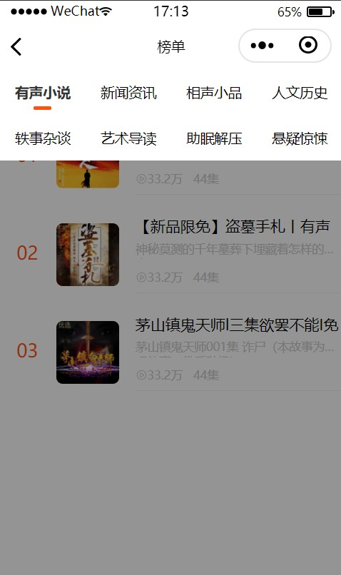

# Ximalaya-Miniprogram
初学微信小程序制作，尝试实现仿喜马拉雅小程序的demo

进度：更新中

| 日期 | 实现页面 | 实现功能                                   | 界面展示                                                     |
| ---- | -------- | ------------------------------------------ | ------------------------------------------------------------ |
| 9.26 | index    | 轮播图、导航格、猜你喜欢、部分模块精选展示 |   |
| 9.27 | bangdan  | 分类榜单、下拉列表                         |  |
|      |          |                                            |                                                              |

